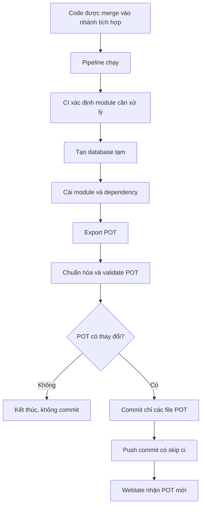
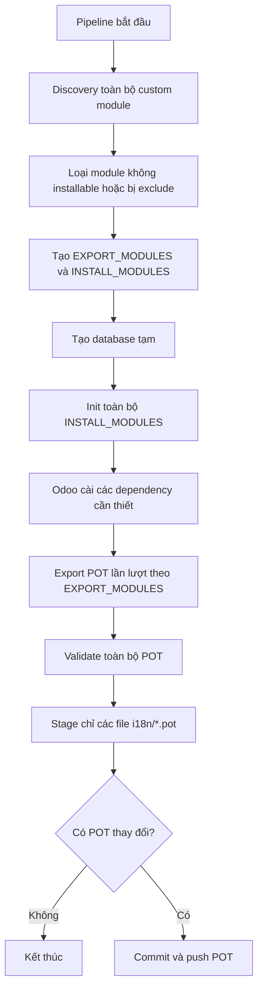
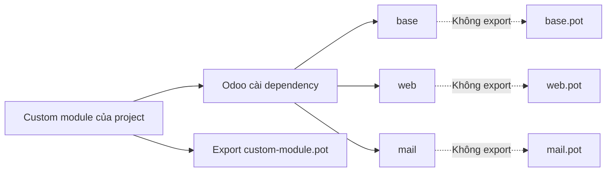
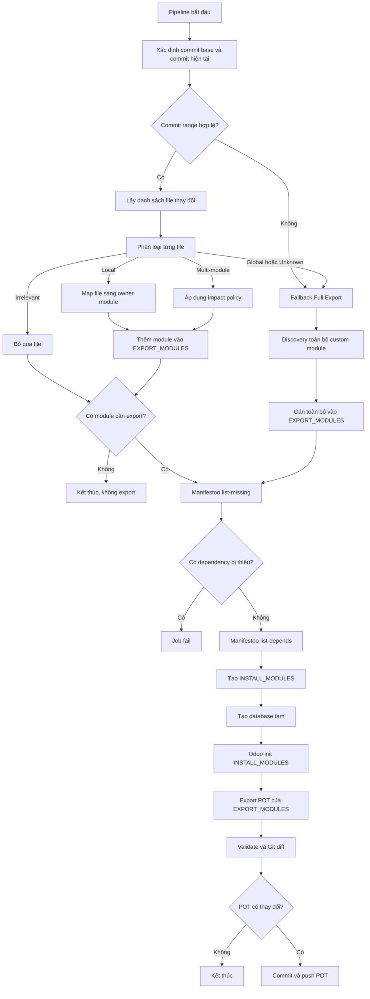
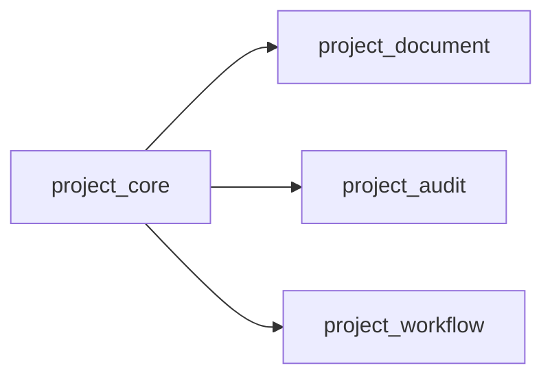

# Phương án triển khai CI Job Export POT cho Odoo Project

## Mục lục

- Ghi chú pilot hiện tại
- 1. Mục tiêu
- 2. Phạm vi xử lý
- 3. Kiến trúc tổng quát
- 4. Solution 1 — Full Export
- 5. Solution 2 — Changed Module Export
- 6. So sánh hai solution

## Ghi chú pilot hiện tại

Các ràng buộc này áp dụng cho pilot hiện tại và phải được giữ khi triển khai các solution trong tài liệu:

- CI job độc lập, chỉ phục vụ `export-i18n`; không sửa luồng production CI/CD ngoài phần được phê duyệt.
- Bắt đầu bằng chế độ artifact-only và local validation; chỉ bật commit/push sau khi POT đã được kiểm chứng.
- Pipeline hiện tại dùng file `pipelines/i18n-test.yml` và GitLab Shell Runner tag `local-shell`.
- Shell Runner dùng môi trường Odoo và PostgreSQL trên host; không thêm `image:` hoặc `services:` như Docker executor.
- Database kiểm thử hiện tại là `qms-local`.
- Python/Odoo hiện tại dùng `/home/linh/odoo-qms/.venv/bin/python` và `odoo-bin` của môi trường Odoo đã được kiểm thử.
- Không thay đổi cơ chế bảo vệ branch `dev`; CI chỉ được commit các POT đã export khi GitLab project và protected branch cho phép rõ ràng.

Các ràng buộc trên mô tả pilot local hiện tại, không phải yêu cầu bắt buộc cho mọi Runner production. Khi môi trường thay đổi, phải ghi nhận lại executable, database, addons path, runner type và quyền ghi trước khi chỉnh job.

### Các lỗi đã gặp trong pilot Shell Runner

| Lỗi hoặc hiện tượng | Nguyên nhân cần kiểm tra trước | Cách xử lý đúng phạm vi |
| --- | --- | --- |
| `chosen stage ... does not exist` | Job dùng stage chưa có trong danh sách `stages` của pipeline | Dùng stage đã tồn tại hoặc bổ sung stage tối thiểu trong file CI được phê duyệt |
| `no active runners that match tag local-shell` | Runner không active hoặc tag job không khớp tag Runner | Kiểm tra Runner `qms-local-shell`, tag `local-shell`, project assignment và trạng thái active |
| `odoo-bin does not exist` | Đường dẫn Odoo không nằm ở vị trí job đang kiểm tra | Kiểm tra `pwd`, project root, đường dẫn `odoo-bin` và biến executable; không đổi sang Docker executor |
| `Permission denied` khi đọc `/home/linh/odoo-qms` | User `gitlab-runner` không có quyền traverse/read thư mục hoặc virtualenv | Kiểm tra quyền từng thư mục cha và file cần đọc; cấp quyền tối thiểu cho Runner |
| `msgfmt: command not found` | Host Shell Runner chưa cài GNU gettext | Cài `msgfmt` trên host Runner và kiểm tra lại bằng `command -v msgfmt` |
| Database connection failed | Sai host/port/user/password/database hoặc PostgreSQL host không cho kết nối từ Runner | Kiểm tra `qms-local`, PostgreSQL listener, role CI riêng và thông tin kết nối; không dùng `postgres` cho job |
| `Using the database user postgres is a security risk` | Odoo chặn role quản trị `postgres` khi chạy job | Dùng role CI không phải superuser, có quyền tạo/xóa database tạm theo policy |
| `ModuleNotFoundError: No module named odoo` | Job dùng sai Python, sai working directory, thiếu Odoo root trong `PYTHONPATH` hoặc checkout không đầy đủ | Kiểm tra Python `/home/linh/odoo-qms/.venv/bin/python`, Odoo root, addons path và import trước khi sửa logic export |
| `Manifestoo executable is missing` | Manifestoo chưa được cài trong đúng virtualenv mà Runner đang dùng | Cài và pin Manifestoo trong virtualenv trước khi bật Changed Module Export; không coi lỗi môi trường là lý do để Full fallback |
| POT bị `.gitignore` bỏ qua | Pattern ignore bao phủ file generated POT | Kiểm tra bằng `git check-ignore`; sửa rule được phê duyệt hoặc stage có kiểm soát, sau đó vẫn giới hạn diff ở POT |
| CI push POT trả `403` | Chưa bật Job Token permission, protected `dev` không cho CI identity push hoặc pipeline user không đủ quyền | Kiểm tra GitLab Job Token permission và protected branch; không bỏ bảo vệ `dev` và không cấp direct PO push cho Weblate |
| Không có artifact POT sau job | Job không sinh POT hoặc đường dẫn artifact không khớp; artifact upload không phải bằng chứng export thành công | Đọc log exporter, kiểm tra database/module/output path và lưu diagnostic artifacts riêng |

Không sửa đồng thời Runner, Odoo invocation, database và impact policy khi gặp một lỗi. Xác định boundary đầu tiên bị lỗi, sửa tối thiểu, chạy lại artifact-only rồi mới mở rộng phạm vi.

## 1. Mục tiêu

CI Job Export POT có trách nhiệm tự động cập nhật danh sách chuỗi nguồn cần dịch của các custom module Odoo trong repository của project.

Job thực hiện các tác vụ chính:

1. Xác định các custom module cần xử lý.
2. Tạo database tạm phục vụ quá trình export.
3. Cài đặt các module và dependency cần thiết.
4. Export file `.pot` cho từng module cần xử lý.
5. Chuẩn hóa và validate file POT.
6. So sánh POT mới với phiên bản đang lưu trong Git.
7. Commit và push các file POT có thay đổi.

Phạm vi sở hữu của CI là các file POT thuộc custom module được quản lý trong repository của project.

Các module Odoo core như `base`, `web` hoặc `mail` có thể được cài đặt để đáp ứng dependency runtime, nhưng không thuộc phạm vi export và commit POT của job.

---

## 2. Phạm vi xử lý

Một Odoo project có thể chứa nhiều custom module:

```text
project_core
project_document
project_audit
project_workflow
...
```

Mỗi module quản lý file POT riêng:

```text
<module>/i18n/<module>.pot
```

Ví dụ:

```text
project_document/i18n/project_document.pot
```

Có hai phương án triển khai CI Job:

1. **Solution 1 — Full Export:** export toàn bộ custom module hợp lệ trong phạm vi repository.
2. **Solution 2 — Changed Module Export:** chỉ export các custom module bị ảnh hưởng bởi thay đổi trong commit.

Hai solution có cùng phạm vi sở hữu POT. Sự khác biệt nằm ở số lượng module được cài đặt và export trong mỗi pipeline.

---

## 3. Kiến trúc tổng quát



Hai solution chỉ khác nhau tại bước xác định module cần xử lý.

---

# 4. Solution 1 — Full Export

## 4.1. Khái niệm

Full Export là phương án CI tìm và export toàn bộ custom module hợp lệ trong repository của project.

Khi biến `I18N_MODULES` để trống:

```yaml
I18N_MODULES: ""
```

CI quét repository để tìm các file:

```text
__manifest__.py
```

Một thư mục được coi là module hợp lệ khi:

* Có file `__manifest__.py`.
* Có file `__init__.py`.
* Manifest có thể parse thành dictionary.
* Module không có `installable: false`.
* Module không nằm trong danh sách loại trừ.

Kết quả discovery được dùng cho cả hai danh sách:

```text
EXPORT_MODULES  = toàn bộ custom module hợp lệ
INSTALL_MODULES = toàn bộ custom module hợp lệ
```

Odoo tự cài thêm các dependency chưa có khi khởi tạo các module này.

---

## 4.2. Luồng xử lý



---

## 4.3. Phạm vi kiểm tra

Full Export kiểm tra lại toàn bộ custom module thuộc phạm vi repository.

Full Export không có nghĩa là export toàn bộ module trong `addons-path`. Các dependency Odoo core hoặc addon bên ngoài chỉ được cài để đáp ứng runtime và không được đưa vào `EXPORT_MODULES`.



---

## 4.4. Trường hợp phù hợp

Full Export phù hợp khi:

* Repository chỉ có ít custom module.
* Thời gian pipeline vẫn chấp nhận được.
* Các module phụ thuộc chặt vào nhau.
* Mỗi thay đổi thường tác động đến nhiều module.
* Nhóm triển khai ưu tiên độ đơn giản và độ tin cậy.
* Chưa có benchmark chứng minh cần tối ưu theo module thay đổi.
* Weblate mới chỉ pilot một hoặc một số ít component.

---

## 4.5. Đặc điểm triển khai

Full Export không cần:

* Phân tích Git diff để map file sang module.
* Xây dependency graph riêng phục vụ impact analysis.
* Phân loại local change và global change.
* Xử lý file chưa xác định được phạm vi ảnh hưởng.
* Duy trì impact policy đặc thù cho cấu trúc repository.

Job cần bảo đảm:

1. Discovery đúng toàn bộ custom module thuộc phạm vi project.
2. Database tạm được tạo sạch.
3. Các module được cài thành công.
4. POT được export ổn định.
5. Chỉ file POT được commit.
6. Commit có `[skip ci]` để tránh pipeline lặp.

---

# 5. Solution 2 — Changed Module Export

## 5.1. Khái niệm

Changed Module Export là phương án CI chỉ export các custom module được xác định là bị ảnh hưởng bởi commit hiện tại.

---

## 5.2. `EXPORT_MODULES` và `INSTALL_MODULES`

Changed Module Export sử dụng hai danh sách có trách nhiệm khác nhau:

| Danh sách | Vai trò |
| --- | --- |
| `EXPORT_MODULES` | Các custom module cần sinh lại POT |
| `INSTALL_MODULES` | Các module cần có trong database để `EXPORT_MODULES` có thể khởi tạo và export thành công |

Quan hệ:

```text
INSTALL_MODULES
=
EXPORT_MODULES
+
dependency bắc cầu của EXPORT_MODULES
```

Ví dụ:

```text
project_document depends:
- base
- mail
- web
- project_core
```

Khi `project_document` thay đổi:

```text
EXPORT_MODULES:
- project_document

INSTALL_MODULES:
- project_document
- project_core
- base
- mail
- web
```

Chỉ `project_document.pot` được export và commit. Các module còn lại chỉ phục vụ runtime.

---

## 5.3. Phân loại thay đổi

Mỗi file trong Git diff cần được phân loại để xác định phạm vi ảnh hưởng.

### Local change

File thuộc rõ một custom module.

Ví dụ:

```text
project_document/models/**
project_document/views/**
project_document/data/**
project_document/security/**
project_document/static/src/**
project_document/__manifest__.py
```

Xử lý:

```text
Export module sở hữu file
```

### Multi-module change

Thay đổi ảnh hưởng đến một tập module xác định được.

Ví dụ:

```text
project_shared
    ↓
được sử dụng bởi:
- project_document
- project_audit
- project_workflow
```

Xử lý:

```text
Export tập module được impact policy xác định
```

Trường hợp này cần dependency mapping hoặc policy riêng của repository.

### Global change

Thay đổi có thể ảnh hưởng đến cơ chế export POT chung hoặc không thể giới hạn an toàn phạm vi ảnh hưởng.

Ví dụ:

```text
.ci/i18n/**
scripts/i18n/**
logic normalize POT
logic xây addons-path
logic gọi --i18n-export
Odoo runtime dùng chung
```

Xử lý:

```text
Fallback Full Export
```

### Irrelevant change

File không tham gia vào runtime hoặc quá trình export i18n.

Ví dụ:

```text
README.md
docs/**
screenshots/**
```

Xử lý:

```text
Không chạy export POT
```

### Unknown change

File không map được sang module và chưa có impact policy.

Ví dụ:

```text
custom_tools/unknown_script.py
```

Xử lý an toàn trong giai đoạn đầu:

```text
Unknown → Full Export
```

Sau khi xác minh vai trò của file, policy có thể được cập nhật để phân loại thành Local, Multi-module, Global hoặc Irrelevant.

---

## 5.4. Luồng xử lý hoàn chỉnh



---

## 5.5. Xác định commit range

Trong pipeline push trên nhánh tích hợp, CI có thể so sánh:

```text
CI_COMMIT_BEFORE_SHA
        ↓
CI_COMMIT_SHA
```

Ví dụ:

```bash
git diff --name-only "$CI_COMMIT_BEFORE_SHA" "$CI_COMMIT_SHA"
```

Commit range được coi là không hợp lệ trong các trường hợp như:

* Pipeline đầu tiên.
* Force push.
* `CI_COMMIT_BEFORE_SHA` là zero SHA.
* Runner không có đủ Git history.
* Không tìm được merge base.

Các trường hợp này được xử lý theo cơ chế Full fallback tại mục 5.8.

---

## 5.6. Mapping file sang module

CI vẫn cần discovery toàn bộ custom module để xây dựng bản đồ:

```text
module name → module directory
```

Ví dụ:

```text
project_document
→ /builds/.../project_document
```

Khi nhận được file:

```text
project_document/views/document_views.xml
```

CI tìm thư mục module gần nhất chứa:

```text
__manifest__.py
```

Kết quả:

```text
Owner module = project_document
```

Discovery toàn repository vẫn cần thiết, nhưng nhẹ hơn đáng kể so với việc init và export toàn bộ module.

---

## 5.7. Phân tích dependency bằng Manifestoo

### 5.7.1. Nguồn dependency của Odoo

Dependency giữa các Odoo module được khai báo trong trường `depends` của file `__manifest__.py`:

```python
{
    "name": "Project Document",
    "depends": [
        "base",
        "mail",
        "web",
        "project_core",
    ],
}
```

Theo tài liệu chính thức của Odoo, các module trong `depends` phải được load trước module hiện tại. Khi cài đặt module, Odoo cài các dependency chưa có trước khi load module được yêu cầu.

---

### 5.7.2. Công cụ Manifestoo

[Manifestoo](https://manifestoo.readthedocs.io/en/latest/) là công cụ dòng lệnh dùng để phân tích manifest của Odoo addon.

Các khả năng liên quan đến CI Job gồm:

* Liệt kê addon installable.
* Liệt kê dependency trực tiếp và bắc cầu.
* Liệt kê module phụ thuộc ngược.
* Phát hiện dependency bị thiếu.
* Hiển thị dependency tree.
* Liệt kê external dependency.

Tài liệu tham chiếu:

* [Manifestoo — Documentation](https://manifestoo.readthedocs.io/en/latest/)
* [Manifestoo — CLI Reference](https://manifestoo.readthedocs.io/en/latest/cli.html)
* [Manifestoo — Source Repository](https://github.com/acsone/manifestoo)

---

### 5.7.3. Phân chia trách nhiệm

Manifestoo chỉ xử lý dependency graph. Công cụ này không đọc Git diff, không map file sang owner module và không quyết định phạm vi export POT.

| Thành phần | Trách nhiệm |
| --- | --- |
| Git | Xác định danh sách file thay đổi |
| CI impact policy | Phân loại phạm vi ảnh hưởng |
| Module discovery | Map file sang custom module sở hữu |
| Manifestoo | Kiểm tra và tính dependency |
| Odoo | Cài module và export POT |
| GitLab CI | Điều phối, validate, commit và push POT |

`EXPORT_MODULES` được xác định trước khi gọi Manifestoo. Manifestoo nhận danh sách này để kiểm tra dependency và xây dựng `INSTALL_MODULES`.

---

### 5.7.4. Tính `INSTALL_MODULES`

Manifestoo cho phép chọn module bằng `--select`, lấy dependency bằng `list-depends`, mở rộng dependency bắc cầu bằng `--transitive` và bao gồm chính module được chọn bằng `--include-selected`.

```bash
INSTALL_MODULES="$(
    manifestoo \
        --addons-path "$ADDONS_PATH" \
        --select "$EXPORT_MODULES_CSV" \
        list-depends \
        --transitive \
        --include-selected \
        --separator=,
)"
```

| Tham số | Vai trò |
| --- | --- |
| `--addons-path` | Khai báo các thư mục chứa addon |
| `--select` | Chọn các module trong `EXPORT_MODULES` |
| `list-depends` | Liệt kê dependency của module được chọn |
| `--transitive` | Lấy toàn bộ dependency bắc cầu |
| `--include-selected` | Bao gồm chính các export module |
| `--separator=,` | Xuất danh sách phân cách bằng dấu phẩy |

Kiểm tra kết quả:

```bash
if [ -z "$INSTALL_MODULES" ]; then
    echo "ERROR: Manifestoo returned an empty install module list."
    exit 1
fi

echo "Export modules:  $EXPORT_MODULES_CSV"
echo "Install modules: $INSTALL_MODULES"
```

Danh sách được truyền vào Odoo:

```bash
"$ODOO_PYTHON" "$ODOO_BIN" \
    --database="$TEMP_DB" \
    --addons-path="$ADDONS_PATH" \
    --init="$INSTALL_MODULES" \
    --without-demo=all \
    --no-http \
    --stop-after-init
```

Chỉ module trong `EXPORT_MODULES` được export POT. Các module chỉ có trong `INSTALL_MODULES` được cài để đáp ứng runtime dependency.

---

### 5.7.5. Kiểm tra dependency bị thiếu

Manifestoo cung cấp `list-missing` để liệt kê dependency không tồn tại trong addons path.

```bash
MISSING_DEPENDENCIES="$(
    manifestoo \
        --addons-path "$ADDONS_PATH" \
        --select "$EXPORT_MODULES_CSV" \
        list-missing \
        --separator=,
)"
```

CI phải dừng nếu có dependency bị thiếu:

```bash
if [ -n "$MISSING_DEPENDENCIES" ]; then
    echo "ERROR: Missing Odoo dependencies: $MISSING_DEPENDENCIES"
    exit 1
fi
```

Không sử dụng `--ignore-missing` trong pipeline production vì việc bỏ qua dependency có thể làm kết quả export phụ thuộc vào trạng thái môi trường Runner.

Dependency thiếu, manifest không hợp lệ hoặc Manifestoo thực thi lỗi phải làm job thất bại. Không fallback Full Export trong các trường hợp này vì Full Export cũng không thể bảo đảm kết quả đúng trên một môi trường dependency không hợp lệ.

---

### 5.7.6. Reverse dependency

Manifestoo cung cấp `list-codepends` để lấy các module phụ thuộc vào module được chọn.

```bash
CODEPENDENT_MODULES="$(
    manifestoo \
        --addons-path "$ADDONS_PATH" \
        --select "$CHANGED_MODULES_CSV" \
        list-codepends \
        --transitive \
        --include-selected \
        --separator=,
)"
```

Ví dụ:



Khi `project_core` thay đổi, `list-codepends` có thể trả về:

```text
project_core,project_document,project_audit,project_workflow
```

Codependency chỉ là tập ứng viên bị ảnh hưởng. Quan hệ một module phụ thuộc module khác không bảo đảm POT của module phụ thuộc sẽ thay đổi.

Kết quả `list-codepends` phải được xử lý bằng impact policy:

| Policy | Cách xử lý |
| --- | --- |
| Strict local | Chỉ export owner module |
| Conservative | Export owner module và codependent custom module |
| Rule-based | Chỉ thêm codependent cho một số shared module |
| Unknown impact | Fallback Full Export |

---

## 5.8. Full fallback

Changed Module Export phải chuyển sang Full Export khi CI không thể chứng minh an toàn phạm vi ảnh hưởng của thay đổi.

Các trường hợp fallback gồm:

* Không xác định được commit base hoặc commit range hợp lệ.
* Module bị xóa hoặc đổi tên.
* Logic export hoặc normalize POT thay đổi.
* Cấu hình i18n chung thay đổi.
* Addons path hoặc Odoo runtime dùng chung thay đổi.
* Version Manifestoo thay đổi nhưng chưa có baseline tương thích.
* File được phân loại là Global.
* File chưa có impact policy.
* Mapping file sang module thất bại.
* Dependency graph không thể được xây dựng đầy đủ do chưa xác định được phạm vi module.
* CI không thể chứng minh thay đổi chỉ ảnh hưởng đến một tập module xác định.

Khi fallback, CI gán toàn bộ custom module hợp lệ trong repository vào `EXPORT_MODULES`, sau đó tiếp tục kiểm tra dependency và xây dựng `INSTALL_MODULES` theo cùng một luồng.

Nguyên tắc:

> Khi CI không thể chứng minh thay đổi chỉ ảnh hưởng đến một tập module xác định, CI phải export toàn bộ custom module thuộc phạm vi repository của project.

Fallback không được dùng để che giấu lỗi môi trường, manifest hoặc dependency. Các lỗi đó phải làm job thất bại.

---

# 6. So sánh hai solution

| Tiêu chí | Solution 1 — Full Export | Solution 2 — Changed Module Export |
| --- | --- | --- |
| Phạm vi sở hữu POT | Toàn bộ custom module của project | Toàn bộ custom module của project |
| Phạm vi xử lý mỗi pipeline | Tất cả custom module | Module bị ảnh hưởng |
| Export POT Odoo core | Không | Không |
| Cài dependency như `base`, `web`, `mail` | Có, khi module cần | Có, khi module cần |
| Độ đơn giản | Cao | Thấp hơn |
| Độ tin cậy | Cao | Cao nếu policy và fallback đầy đủ |
| Thời gian pipeline | Tăng theo số lượng module | Phụ thuộc số module thay đổi |
| Yêu cầu Git diff | Không | Có |
| Yêu cầu map file sang module | Không | Có |
| Yêu cầu dependency graph cho impact analysis | Không | Có |
| Yêu cầu global-change policy | Không | Có |
| Xử lý unknown change | Không cần | Fallback Full Export |
| Chi phí bảo trì | Thấp | Trung bình đến cao |
| Debug pipeline | Dễ | Phức tạp hơn |
| Rủi ro bỏ sót POT | Rất thấp | Có nếu policy sai hoặc thiếu fallback |
| Project nhiều module, thay đổi một module | Chậm | Nhanh |
| Project nhiều module, thay đổi nhiều module | Chậm | Có thể giống Full Export |
