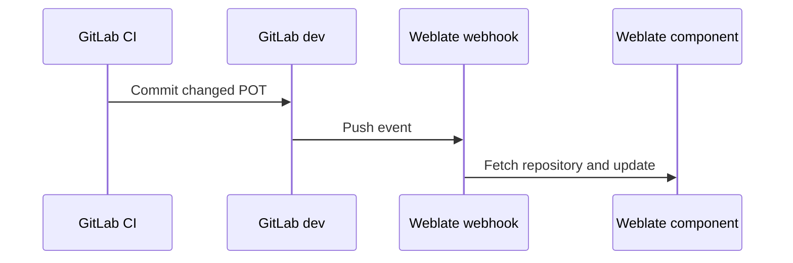

# Cấu hình tích hợp GitLab cho Weblate

## Mục lục

1. Phạm vi
2. Luồng và nguyên tắc sở hữu
3. Credential và quyền
4. Chọn Git transport
5. Cấu hình GitLab cho CI commit POT
6. Cấu hình protected branch `dev`
7. Cấu hình GitLab API credential cho Weblate
8. Cấu hình GitLab webhook
9. Kiểm thử tích hợp end-to-end
10. Xử lý lỗi
11. Tài liệu tham chiếu

## 1. Phạm vi

Tài liệu này mô tả các cấu hình và kiểm thử ở phía GitLab để kết nối Weblate với repository Odoo QMS.

Phạm vi gồm:

- Quyền và credential.
- Git transport và GitLab API.
- Branch policy.
- CI Job Token cho commit POT.
- Protected branch.
- GitLab Push-event webhook.
- Kiểm thử end-to-end và xử lý lỗi tích hợp.

Không mô tả:

- Docker, database, tunnel và persistent volume: `weblate-self-hosted-deployment.md`.
- Các trường cấu hình trong Weblate Component: `weblate-settings-configuration.md`.
- Nội dung và YAML của CI export job: tài liệu CI job hiện có.

## 2. Luồng và nguyên tắc sở hữu

Luồng triển khai sử dụng các branch sau:

| Branch | Owner | Mục đích |
|---|---|---|
| `dev` | GitLab project | Branch nguồn và branch đích của code/translation MR |
| `weblate-translations` | Weblate | Branch tạm chứa các thay đổi PO trước khi tạo MR |
| CI-generated commit trên `dev` | CI Bot | Chỉ cập nhật POT đã export và validate |

Quy tắc sở hữu:

- Developer sở hữu source code và source string.
- CI sở hữu việc export và commit file POT.
- Weblate/BA sở hữu nội dung `msgstr` trong PO.
- Weblate không được push PO trực tiếp vào `dev`.
- Review và merge translation MR thực hiện trên GitLab.
- Không thêm bước review riêng trên Weblate; BA/Translator là gate duy nhất của nội dung dịch trước khi MR được review/merge trên GitLab.

## 3. Credential và quyền

| Mục đích | Credential | Quyền tối thiểu |
|---|---|---|
| Weblate clone/fetch | Git SSH key hoặc Git HTTPS credential | Read repository |
| Weblate push `weblate-translations` | Git SSH key hoặc Git HTTPS credential | `write_repository` |
| Weblate tạo GitLab MR | GitLab API token | `api` |
| CI push POT vào `dev` | `CI_JOB_TOKEN` | Được project cho phép push và phù hợp protected branch |

GitLab API token không thay thế credential dùng cho Git clone/push. Một token có thể đảm nhiệm nhiều vai trò nếu policy cho phép, nhưng quyền phải được kiểm soát theo mục đích.

Không ghi token thật vào Compose, Git repository, log, screenshot hoặc tài liệu.

## 4. Chọn Git transport

Kiểm tra route từ chính container Weblate trước khi chọn transport. Host chạy Docker truy cập được GitLab không có nghĩa là container cũng truy cập được GitLab.

| Phương án | URL/credential | Dùng khi |
|---|---|---|
| SSH | `git@gitlab.example.com:group/project.git` và SSH key | Container truy cập được SSH port GitLab |
| Native HTTPS | URL HTTPS có username và credential/token được bảo vệ | HTTPS hoạt động và chấp nhận lưu credential ở cấu hình repository |
| HTTPS credential helper | URL HTTPS sạch, credential helper/askpass trong persistent data | Không muốn nhúng credential vào repository URL |

Không đổi sang SSH nếu SSH từ container bị timeout trong khi HTTPS đang hoạt động.

Kiểm tra kết nối từ container:

```bash
docker compose exec weblate getent hosts gitlab.example.com
docker compose exec weblate sh -lc 'curl -I https://gitlab.example.com'
```

Không sử dụng URL Git có embedded credential trong tài liệu hoặc log.

## 5. Cấu hình GitLab cho CI commit POT

CI export job đã được mô tả ở tài liệu CI job. Ở phía GitLab cần bật quyền cho `CI_JOB_TOKEN`:

`Project → Settings → CI/CD → Job token permissions → Permissions → Allow Git push requests to the repository`

Quyền này chỉ cho phép job token thực hiện Git push theo policy của project. Nó không tự động vượt qua protected branch.

Kiểm tra thêm:

- Job thực sự dùng `CI_JOB_TOKEN` cho remote push.
- Protected branch `dev` cho phép user khởi chạy pipeline và CI identity push theo policy hiện tại.
- Job chỉ commit các file POT được phép.
- Commit sinh bởi CI có cơ chế loop prevention, ví dụ `[skip ci]` theo policy project.
- Push do `CI_JOB_TOKEN` không làm phát sinh vòng export ngoài ý muốn.

## 6. Cấu hình protected branch `dev`

Giữ nguyên cơ chế bảo vệ branch hiện tại. Cấu hình cần đạt:

- Developer không tự ý push trực tiếp code vào `dev`.
- Code change và translation change đi qua MR.
- CI identity chỉ được phép cập nhật POT theo ngoại lệ đã thống nhất.
- Weblate không được cấp quyền push PO trực tiếp vào `dev`.
- Maintainer/CTO vẫn review và merge MR trên GitLab.

Nếu policy protected branch không cho phép CI push POT trực tiếp, phải chuyển riêng phần POT sang technical MR; không thay đổi policy Weblate để push PO trực tiếp vào `dev`.

## 7. Cấu hình GitLab API credential cho Weblate

Trong baseline hiện tại, service `weblate` đọc credential từ file `./environment` qua `env_file`. Vì vậy các dòng trong file phải dùng cú pháp `KEY=value`; không dùng cú pháp YAML `KEY: value`.

Ví dụ đã loại bỏ secret:

```dotenv
WEBLATE_GITLAB_HOST=gitlab.vdx.vn
WEBLATE_GITLAB_USERNAME=<gitlab-username>
WEBLATE_GITLAB_TOKEN=<rotated-gitlab-token>
```

Weblate self-host cũng có thể nhận credential bằng environment substitution hoặc Docker secret. Chọn một phương án, không cấu hình đồng thời biến token dạng giá trị và `_FILE`.

Nếu cấu hình trực tiếp trong Compose, YAML mapping mới dùng dấu `:`:

```yaml
services:
  weblate:
    environment:
      WEBLATE_GITLAB_HOST: gitlab.vdx.vn
      WEBLATE_GITLAB_USERNAME: <gitlab-username>
      WEBLATE_GITLAB_TOKEN: ${WEBLATE_GITLAB_TOKEN}
```

`WEBLATE_GITLAB_HOST` chỉ là hostname, không có scheme hoặc path.

Sau khi thay đổi credential, recreate service Weblate rồi kiểm tra backend `GitLab merge request` xuất hiện trong Weblate. Docker Compose chỉ nạp lại environment khi container được recreate, không phải chỉ restart process bên trong container.

## 8. Cấu hình GitLab webhook

Trong GitLab mở:

`Project → Settings → Webhooks → Add new webhook`

Điền URL:

```text
https://<weblate-domain>/hooks/gitlab/
```

Bật:

- Push events.

Webhook dùng cho chiều đồng bộ từ GitLab vào Weblate:



Webhook không chạy Odoo exporter và không tạo translation MR. Weblate tự fetch repository sau khi nhận event; việc tạo MR outbound sử dụng GitLab API credential và cấu hình component.

Kiểm tra trong GitLab webhook request history:

- HTTP status thành công.
- URL đúng hostname hiện tại.
- Request được gửi sau commit POT vào `dev`.
- Không bị tunnel, TLS, firewall hoặc CSRF chặn.

## 9. Kiểm thử tích hợp end-to-end

Thực hiện trên fork hoặc project test trước khi áp dụng vào repository công ty.

### 9.1. Chuẩn bị

1. Thêm một source string translatable không ảnh hưởng nghiệp vụ.
2. Tạo code MR vào `dev`.
3. Merge code MR theo quy trình hiện có.

### 9.2. Kiểm tra chiều POT

1. Xác nhận post-merge pipeline chạy.
2. Xác nhận `export-i18n` chạy với đúng Odoo environment.
3. Xác nhận POT chứa source string mới.
4. Xác nhận CI commit chỉ file POT thay đổi.
5. Xác nhận changed-POT path chưa deploy trước khi translation MR được merge.
6. Xác nhận lần chạy exporter tiếp theo không tạo vòng lặp.

### 9.3. Kiểm tra Weblate và translation MR

1. Xác nhận webhook được GitLab gửi thành công.
2. Xác nhận component Weblate thấy source unit mới.
3. Dịch source unit bằng BA/Translator.
4. Commit và push từ Weblate.
5. Xác nhận GitLab có MR từ `weblate-translations` vào `dev`.
6. Xác nhận CTO/maintainer review trên GitLab.
7. Merge translation MR.
8. Xác nhận post-merge pipeline chạy lại.
9. Xác nhận POT không thay đổi và pipeline tiếp tục deployment bình thường.

### 9.4. Evidence cần lưu

| Checkpoint | Evidence |
|---|---|
| Code MR | MR đã merge vào `dev` |
| CI export | Pipeline URL và exporter log |
| POT commit | Commit chỉ chứa POT |
| Webhook | GitLab webhook request history |
| Weblate sync | Source unit mới hiển thị trong component |
| Translation MR | MR từ `weblate-translations` vào `dev` |
| No export loop | Pipeline sau translation MR không tạo POT mới |
| Deployment | Existing deployment job tiếp tục thành công |

## 10. Xử lý lỗi

### 10.1. Credential và Git transport

| Lỗi | Nguyên nhân | Cách kiểm tra và xử lý |
|---|---|---|
| `Could not push: terminal prompts disabled` | Weblate dùng HTTPS private repository nhưng Git không có credential để prompt | Cấu hình Git credential qua push URL được bảo vệ, SSH key hoặc credential helper; Weblate không thể nhập password tương tác |
| `miss credentials` | Biến credential không được nạp, dùng sai host hoặc file `environment` dùng cú pháp YAML `:` | Dùng `WEBLATE_GITLAB_HOST=...`, `WEBLATE_GITLAB_USERNAME=...`, `WEBLATE_GITLAB_TOKEN=...`; recreate container và kiểm tra đúng hostname |
| `403: You are not allowed to upload code` khi Weblate push | Token thiếu `write_repository`, push URL sai, branch bị bảo vệ hoặc user không có quyền ghi | Kiểm tra quyền Git của token, repository push URL và quyền ghi vào `weblate-translations`; không cấp direct push vào `dev` |
| Weblate clone thất bại | Container không có route tới GitLab, sai Git URL hoặc thiếu read permission | Kiểm tra DNS/HTTPS/Git từ container Weblate; tunnel inbound không thay thế route outbound qua VPN |
| SSH báo `publickey` | SSH key chưa được authorize hoặc container không dùng đúng key | Kiểm tra key trong chính container Weblate; nếu SSH port không đi được thì chuyển sang HTTPS |
| `Enter a valid URL` | Repository URL hoặc push URL sai format, sai host/path hoặc chứa credential không hợp lệ | Dùng URL GitLab đúng repository; không dùng URL của tunnel Weblate và không nhúng token vào tài liệu |

### 10.2. GitLab API và Merge Request

| Lỗi | Nguyên nhân | Cách kiểm tra và xử lý |
|---|---|---|
| `insufficient_scope` khi tạo MR | GitLab API token không có scope `api` hoặc credential chưa được recreate vào Weblate | Cấp token API đúng scope, cập nhật environment/secret, recreate Weblate và tạo commit test mới |
| Branch đã push nhưng không có MR | Backend chỉ là Git, API host/token sai hoặc push branch để trống | Dùng backend `GitLab merge request`, đặt API host đúng hostname GitLab, đặt push branch `weblate-translations` và kiểm tra GitLab UI |
| Weblate push trực tiếp vào `dev` | Push branch để trống hoặc cấu hình nhầm target branch | Giữ `Repository branch=dev`, `Push branch=weblate-translations`; mọi PO phải đi qua MR |
| MR sửa POT/source | Weblate đang quản lý sai component root/file mask hoặc có job khác ghi đè | Kiểm tra ownership boundary; Weblate chỉ được tạo thay đổi PO/msgstr |
| Translation MR bị conflict | Weblate còn commit pending hoặc GitLab có thay đổi PO đồng thời | Commit/push thay đổi đang chờ trên Weblate, lock/flush component rồi mới xử lý rewrite bên ngoài |

### 10.3. CI Job Token và protected branch

| Lỗi | Nguyên nhân | Cách kiểm tra và xử lý |
|---|---|---|
| `403` khi CI commit POT vào `dev` | Chưa bật Job Token permission, protected branch không cho CI identity push hoặc pipeline user không đủ quyền | Bật `Settings → CI/CD → Job token permissions → Allow Git push requests to the repository`; kiểm tra lại protected branch và user chạy pipeline |
| CI push POT chạy vòng lặp | Thiếu `[skip ci]` hoặc rules nhận lại commit generated | Chỉ stage POT, dùng marker loop-prevention đã thống nhất và kiểm tra pipeline sau generated commit |
| CI commit cả PO/source | Job không giới hạn diff theo POT path | Fail job nếu diff ngoài `*/i18n/*.pot`; không commit partial output |

### 10.4. Webhook và đồng bộ source string

| Lỗi | Nguyên nhân | Cách kiểm tra và xử lý |
|---|---|---|
| GitLab push nhưng Weblate không pull | Commit chưa vào `dev`, webhook chưa bật Push events, URL tunnel hết hạn hoặc request thất bại | Kiểm tra commit branch, webhook request history, HTTP status và URL `/hooks/gitlab/` |
| Webhook thành công nhưng không thấy `_()` string mới | POT chưa được CI cập nhật, component đang trỏ sai branch/template hoặc msgmerge chưa chạy | Kiểm tra POT commit trước; sau đó kiểm tra `Repository branch=dev`, `Template for new translations` và add-on msgmerge |
| Weblate không phản hồi sau webhook | Component bị lock hoặc repository update lỗi | Mở component, xem repository maintenance/log, xử lý lỗi Git rồi unlock và chạy update lại |
| Webhook chỉ hoạt động khi tunnel còn hostname cũ | Quick tunnel thay đổi hostname | Dùng hostname tunnel hiện tại trong GitLab webhook và `WEBLATE_SITE_DOMAIN`; production cần hostname cố định |

## 11. Tài liệu tham chiếu

- [GitLab Webhooks](https://docs.gitlab.com/user/project/integrations/webhooks/)
- [GitLab job token permissions](https://docs.gitlab.com/ci/jobs/ci_job_token/)
- [Weblate GitLab integration](https://docs.weblate.org/en/latest/admin/projects.html)
